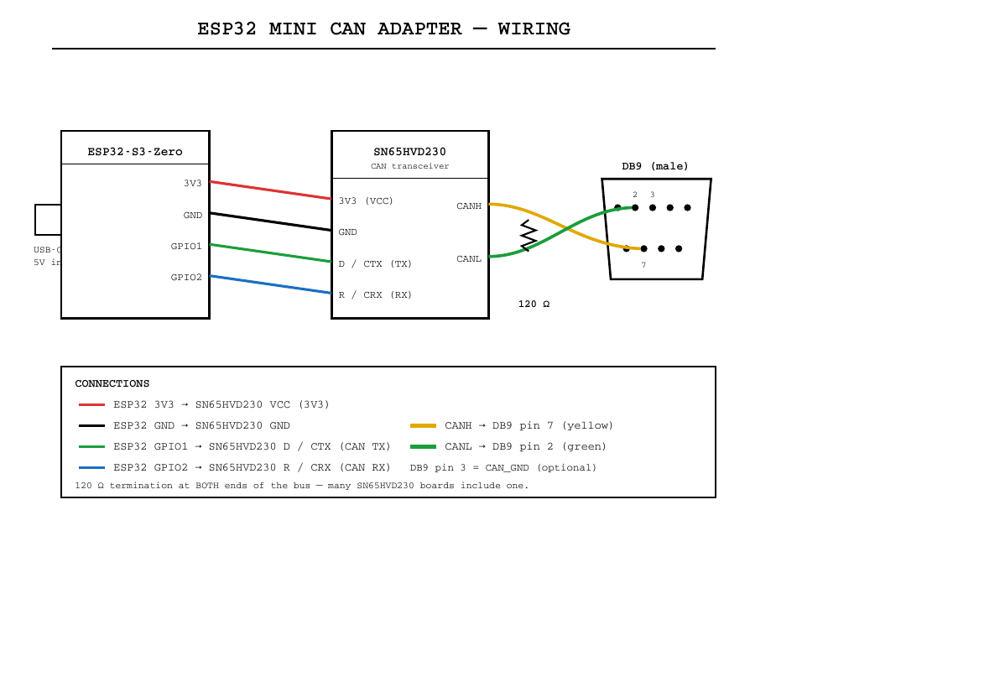

# ESP32 Mini CAN Communication Adapter

Communicate with a CAN device through a **self-hosted web interface** — no app, no drivers, no desktop software. Flash an ESP32-S3, power it over USB-C, join its Wi-Fi, and open a clean web page to **send any CAN frame** and **watch all bus traffic** live.

Housed in a compact 3D-printed case with a standard **DB9** CAN connector.

> 3D-printable case + parts list on MakerWorld: **ESP32 Mini CAN Communication Adapter**.

## Features

- **Send** any frame: standard (11-bit) or extended (29-bit) ID, 0–8 data bytes in hex.
- **Monitor** the bus: a live table with one row per ID — frame type, DLC, latest data, and a hit count.
- **Switchable bit rate:** 125 / 250 / 500 kbit / 1 Mbit, right from the page.
- **Self-hosted** — the device runs its own Wi-Fi access point and serves the interface to any phone or laptop. Works fully offline.
- **No external libraries** beyond the Arduino-ESP32 core. The web UI lives in an editable `index.html` and is baked into the firmware at build time.

## How it works

The ESP32's built-in TWAI (CAN) controller drives the bus through a 3.3 V transceiver out to the DB9. The firmware brings up a Wi-Fi AP and a small web server; the page polls for received frames a few times a second and posts your sends back. That's the whole system.

## Components

Designed for use with:

- ESP32-S3 board — https://a.co/d/0gn4M5eo
- SN65HVD230 CAN transceiver — https://a.co/d/02VE1raJ
- A standard **DB9** CAN connector (male)
- USB-C cable for power + flashing
- 120 Ω termination resistor, if not already on your transceiver board or bus

> Use a **3.3 V** transceiver (SN65HVD230). A 5 V part would push 5 V into the ESP32's RX pin.

## Wiring

Logic pins are set at the top of `CanTool/CanTool.ino` (`CAN_TX` / `CAN_RX`).

| ESP32-S3 | → | SN65HVD230 |
|---|---|---|
| `3V3` | → | `3V3` (VCC) |
| `GND` | → | `GND` |
| `GPIO 1` (CAN TX) | → | `D` / `CTX` |
| `GPIO 2` (CAN RX) | → | `R` / `CRX` |

| SN65HVD230 | → | DB9 (CiA 303-1) | Wire |
|---|---|---|---|
| `CANH` | → | **pin 7** | yellow |
| `CANL` | → | **pin 2** | green |
| `GND` | → | pin 3 (CAN_GND) | optional |

A CAN bus needs **120 Ω termination at both ends**. Many SN65HVD230 boards include one; the far node provides the other.

## Build & flash

Builds in the cloud via GitHub Actions — no local toolchain required.

1. Put the repo on GitHub (sketch folder `CanTool/`, plus `.github/workflows/build.yml`).
2. Each push runs the **build** workflow and attaches a firmware artifact (`CanTool-firmware`).
3. Download it and flash the `*.merged.bin` to address `0x0` with a web flasher ([espressif.github.io/esptool-js](https://espressif.github.io/esptool-js/)) or `esptool.py`.

Prefer local? Run `python3 gen_webpage.py CanTool/index.html CanTool/webpage.h` to rebuild the page, then open `CanTool/CanTool.ino` in the Arduino IDE, install the **esp32** board package, pick an **ESP32S3** board, and upload. No libraries to add.

The web interface is `CanTool/index.html` — edit it freely; `gen_webpage.py` gzips it into `CanTool/webpage.h`, which the firmware serves. CI regenerates it automatically on every build.

## Usage

1. Power the adapter over USB-C.
2. Join Wi-Fi **`CAN-Tool`** (password **`cantool123`**).
3. Open **`http://192.168.4.1`**.
4. Set the **bus rate** to match your device.
5. **Send:** enter a hex ID, choose Standard or Extended, type up to 8 hex data bytes, hit **Send**.
6. **Monitor:** the table fills with every ID on the bus. **Clear** resets it.

## Notes & limitations

- Runs in **normal mode**, so it ACKs frames like any node. For passive sniffing of a live bus, change `TWAI_MODE_NORMAL` to `TWAI_MODE_LISTEN_ONLY` in `canStart()` (you then can't transmit).
- The monitor is a **per-ID summary** (latest payload + count), capped at 40 unique IDs — a "what's on the bus now" view, not a timestamped log.
- Default pins are `GPIO 1` (TX) / `GPIO 2` (RX).

## Safety

CAN drives real actuators. Sending arbitrary frames onto a live vehicle or machine bus can cause unsafe behavior. Know what you're putting on the wire.

## License

MIT — do whatever, no warranty.
